# llama.cpp KV Prefix Cache Middleware: 85% Less Processing Time After Restart

[中文测试页面](README.zh-CN.md)

This page presents a complete run of the llama.cpp KV prefix cache middleware with Hermes Agent. The focus is practical: after the model restarts and the agent opens a new conversation, can the middleware restore a saved KV prefix and reduce repeated prefix processing?

Environment details: [测试环境.en.md](测试环境.en.md) | [中文环境说明](测试环境.md).

## Main result

> **Persisted KV reuse after a model restart reduced average model processing time from 91.0 seconds to 13.7 seconds: 77.3 seconds less, or about 85.0% lower processing time.**

This is the average of three independent reuse runs in the documented test environment. llama.cpp and Hermes Agent were restarted for each run, so the model process did not retain the previous run's in-process state. The KV snapshot was saved by the middleware and restored before the next request.

| Comparison | Transparent cold start | Middleware with restored KV | Observed change |
| --- | ---: | ---: | ---: |
| Average model processing time | **91.0 s** | **13.7 s** | **77.3 s less (about 85.0% lower)** |
| Three runs | 1:46, 1:24, 1:23 | 0:12, 0:13, 0:16 | Every reuse run was well below baseline |

Another way to read the result: restored-KV processing took about **15.1%** of the transparent-routing baseline, or roughly **one sixth** of the original time in this end-to-end sample.

In practical terms, stable system instructions, tool lists, and other prefix content are built once. After a model restart or a new conversation, the middleware can restore that saved prefix for llama.cpp so the request reaches user-question processing much sooner. This is especially useful when a model is restarted frequently, conversations are switched, or the same agent configuration is reused.

## Summary

llama.cpp and Hermes Agent were restarted before every run to reduce the effect of in-process cache state. The measured results are:

| Scenario | Runs | Model processing time | Average | Meaning |
| --- | ---: | --- | ---: | --- |
| Transparent routing, middleware features stopped, cold start | 3 | 1:46, 1:24, 1:23 | **1:31.0** | Baseline |
| Middleware enabled, first KV build | 3 | 1:30, 1:29, 1:28 | **1:29.0** | Snapshot creation phase, including prefix processing and saving |
| Model restart followed by persisted KV reuse | 3 | 0:12, 0:13, 0:16 | **0:13.7** | About **77.3 seconds (85.0%)** below baseline |
| Different questions using the same KV prefix | 2 | 0:29, 0:24 | **0:26.5** | Two verifiable samples in the available assets; not a controlled latency comparison |
| Transparent routing for another question | 1 | 1:27 | 1:27.0 | One sample only |

The measurements show a clear phase difference: first-time KV creation is close to the transparent cold-start baseline because it includes full prefix processing and snapshot saving. The main benefit appears during later restoration and reuse. After a model restart, the three reuse runs averaged 13.7 seconds versus the 91.0-second transparent baseline, a reduction of 77.3 seconds, or about 85.0% lower processing time.

All values on this page use the model-processing time shown by the Hermes test interface. Averages are arithmetic means for the actually available samples in each test group.

## Test environment

| Item | Configuration |
| --- | --- |
| Device | Mechanical Revolution Jiaolong 16 Pro (R7-7745HX / 16 GB / 1 TB / RTX 4070 / 240 Hz / 2.5K) |
| OS | Windows 11 Pro 23H2, build 22631.5472 |
| CPU | AMD Ryzen 7 7745HX with Radeon Graphics, 3.60 GHz |
| GPU | NVIDIA GeForce RTX 4070 Laptop, 8 GB VRAM |
| Memory | Crucial 16 GB DDR5-4800 SODIMM |
| Virtual memory | 32,000 MB |
| Storage | Samsung SSD 990 EVO Plus 1 TB |
| GPU driver | GeForce Game Ready Driver 610.47 |
| CUDA | 13.2 |
| llama.cpp | llama-b10435-bin-win-cuda-13.3-x64 |
| Hermes Agent | v0.18.2 (2026.7.7.2) |
| Model | Qwen3.6-35B-A3B-IQ2_M GGUF (local model shown in the screenshot) |

### llama.cpp arguments

This run used `--parallel 1`, allowing the middleware to serialize restore, inference, and slot rotation on one slot. Paths and ports are placeholders below:

```text
llama-server.exe -m <model>.gguf -ngl 99 --cpu-moe \
  --ctx-size 65545 --rope-scaling yarn --rope-scale 2 \
  --yarn-orig-ctx 32768 --cache-type-k q4_0 --cache-type-v q4_0 \
  --temperature 0.6 --port <llama-port> --parallel 1 \
  --slot-save-path <slot-save-path> --metrics
```

## Test procedure

### 1. Transparent-routing baseline

The middleware was started and switched to `stop`, leaving only transparent routing. llama.cpp and Hermes Agent were restarted before each run, the same initial prompt was sent, and the model-processing time shown in the test interface was recorded.

### 2. First KV build

The middleware cache feature was enabled. After clean restarts, the same initial prompt was sent and the middleware extracted the stable prefix, prefilled it, and saved a slot snapshot. The `list` command was also used to confirm a `ready` cache record. This measures the one-time build cost, not reuse latency.

### 3. KV reuse after restart

The saved snapshot was kept, llama.cpp was restarted to clear in-process slot state, and Hermes Agent was restarted with a new conversation. The same stable prefix was sent again and the restored-KV response time was recorded.

### 4. Different questions

Different user questions were sent with the same stable prefix. Two result images from this group are available in the asset directory. Because question complexity, output length, and tool paths differ, these runs demonstrate prefix independence rather than provide a controlled latency comparison.

## Result images

### Persisted KV reuse after restart: main effect

This is the key result from the test: with the middleware's saved KV retained, llama.cpp restarted, and a new Hermes conversation opened, model processing took 12, 13, and 16 seconds across three runs.

| Run 1: 12 s | Run 2: 13 s | Run 3: 16 s |
| --- | --- | --- |
| 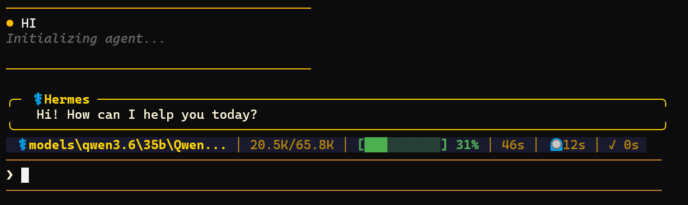 | 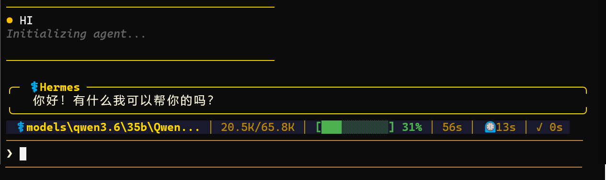 | 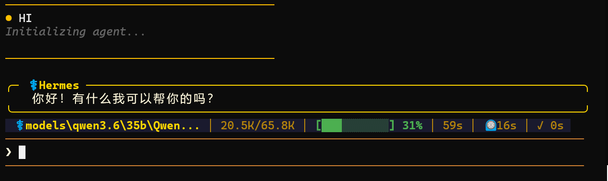 |

### Transparent-routing cold-start baseline

| Run 1: 1:46 | Run 2: 1:24 | Run 3: 1:23 |
| --- | --- | --- |
| 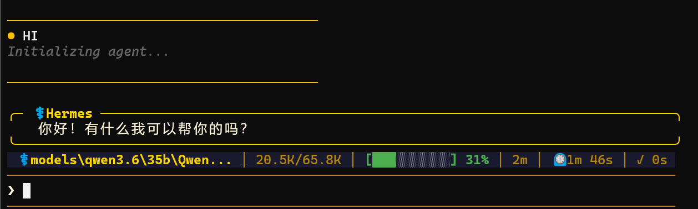 | 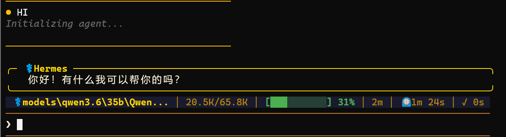 | 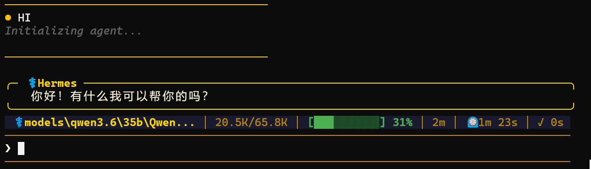 |

### First KV build: model processing time

| Run 1: 1:30 | Run 2: 1:29 | Run 3: 1:28 |
| --- | --- | --- |
| 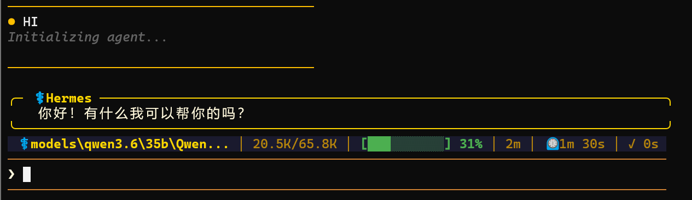 | 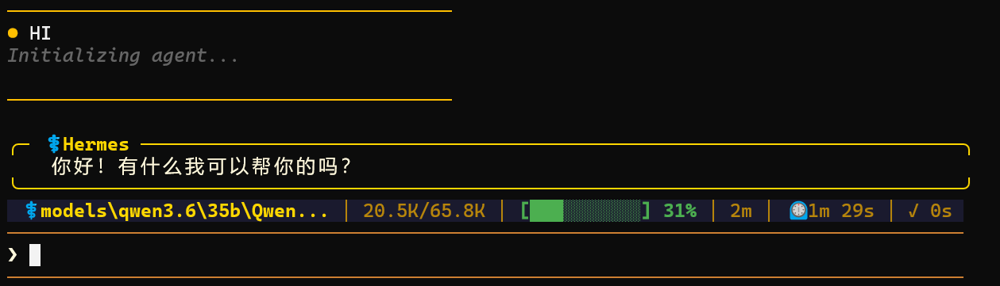 | 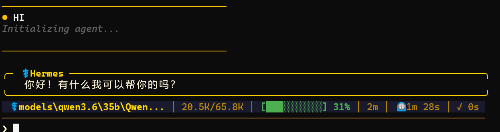 |

### KV build confirmation in the middleware console

These screenshots show the `list` command with `ready` cache records. They confirm cache creation and are status evidence, not timing measurements.

| Run 1 | Run 2 | Run 3 |
| --- | --- | --- |
| 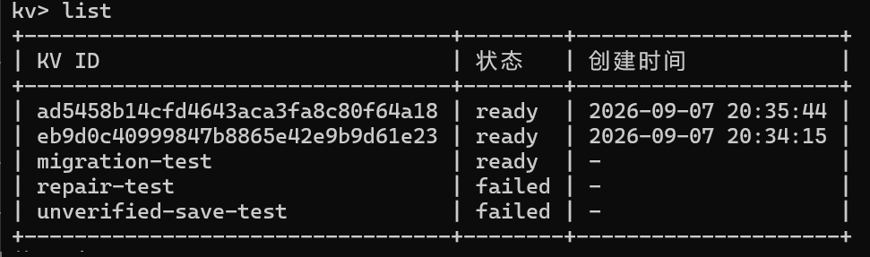 | 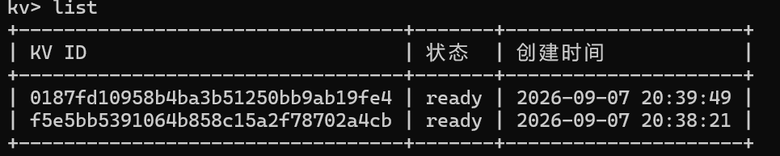 | 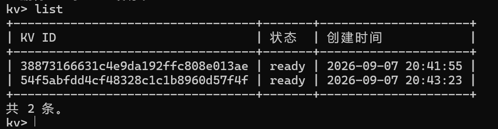 |

### Different questions with the same KV

| Run 2: 29 s | Run 3: 24 s |
| --- | --- |
| 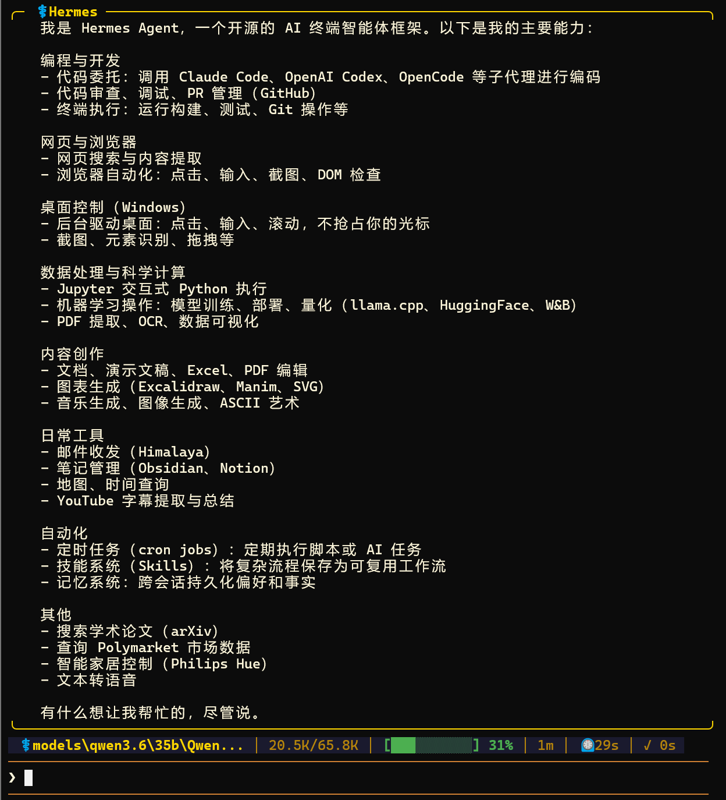 | 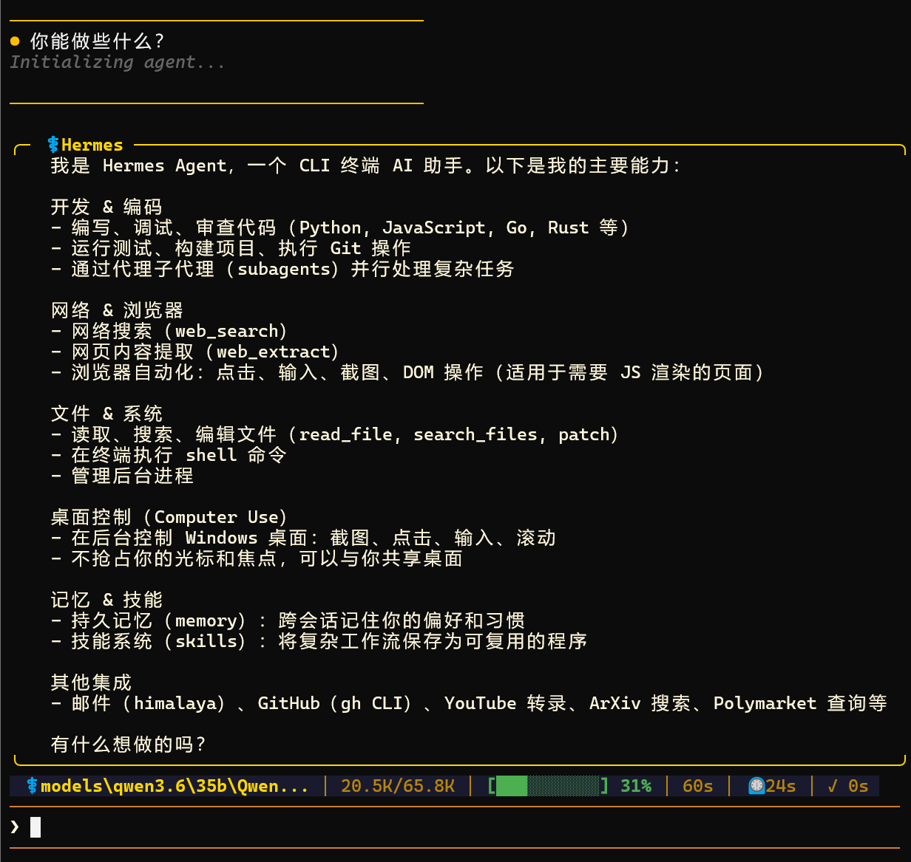 |

### Transparent-routing comparison for another question

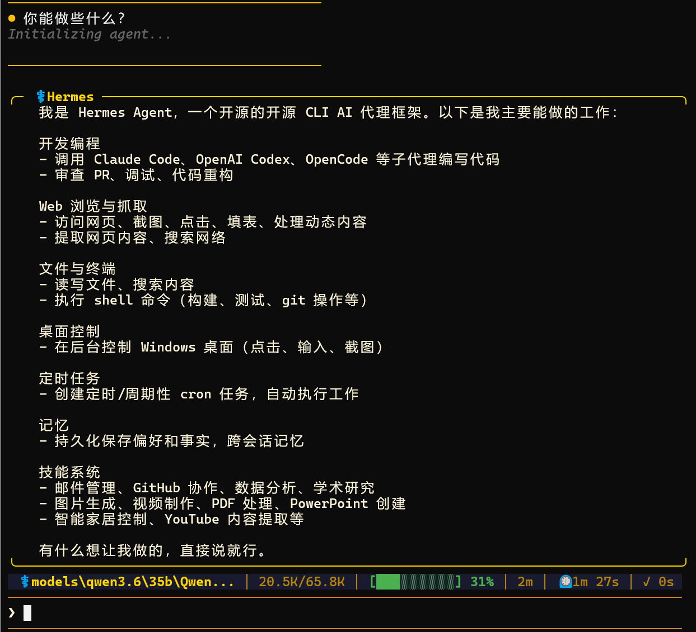

## Interpreting the effect

- First KV creation and later KV reuse are different phases; the build time must not be presented as reuse latency.
- The first-build runs were 1:30, 1:29, and 1:28, averaging **1:29.0**; this includes full prefix processing and snapshot creation.
- The post-restart KV reuse runs were 12, 13, and 16 seconds, averaging **13.7 seconds**. The transparent cold-start baseline averaged **91.0 seconds**, so reuse reduced the average by **77.3 seconds (about 85.0%)**.
- All three reuse runs were well below the cold-start baseline, indicating that the observed gain comes from restoring the stable prefix rather than from one unusually fast run.
- The two available different-question samples were 29 and 24 seconds, averaging **26.5 seconds**. Prompt complexity, output length, tool calls, and agent UI behavior differ, so these samples do not isolate prefill speed.
- Confirm hits using middleware events such as `prefix_cache_restored` and `prefix_cache_result`, together with `cached_tokens` in the model response. A screenshot timer alone proves only an end-to-end timing change.

## Limitations and next steps

The screenshots do not capture exact prompt tokens, `cached_tokens`, TTFT, generated token counts, or disk restore time. This is an end-to-end user-visible demonstration, not a controlled microbenchmark.

A stricter benchmark should hold the user prompt, maximum output tokens, tool path, sampling parameters, and background load constant, and record prefix prefill time, snapshot restore time, new prompt tokens, `cached_tokens`, TTFT, and total response time separately.

When reproducing the run, replace the model path, port, and snapshot directory with local values. The command shown on this page uses placeholders and does not expose the original machine-specific launch screen.
